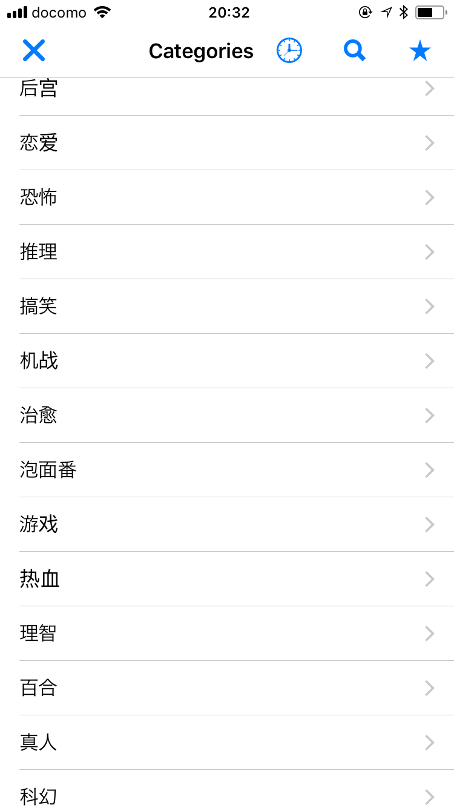

# PystAnimeViewer
Simple anime viewer for Pythonista

-----------------------------------

All anime contents are scraped from a Chinese anime website (dilidili.com) \
Notice that all contents are in **Chinese**! \
UI design is using a simple NavigationView.

*Any contribution is welcome!*
 

## Run: 
Download the files and run `AnimeViewer.py`.

A folder will be created to stored cache files.
You can use optional argument to customize the folder name, e.g. `--cache_name myCacheDir`

## Screenshot:

